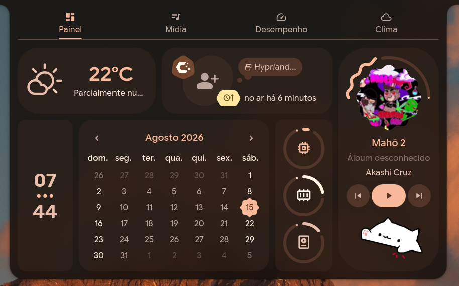
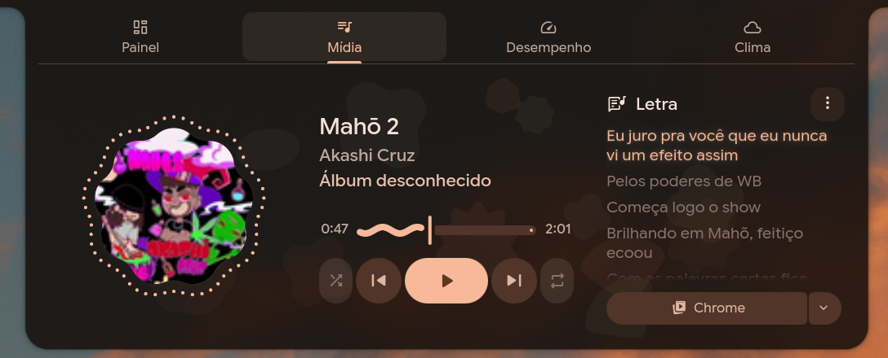
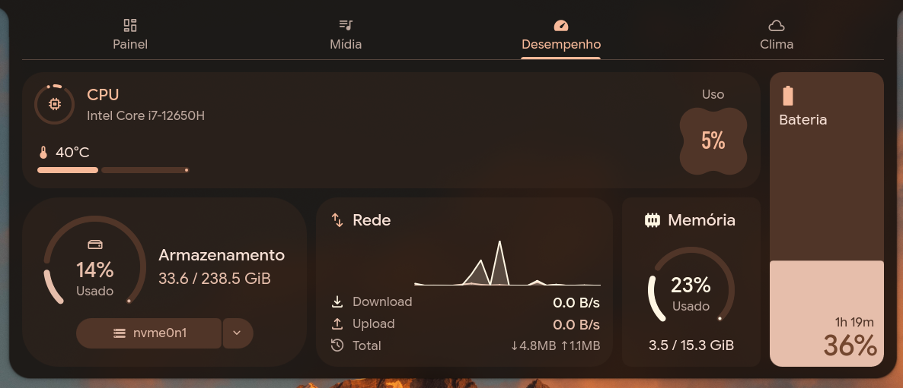
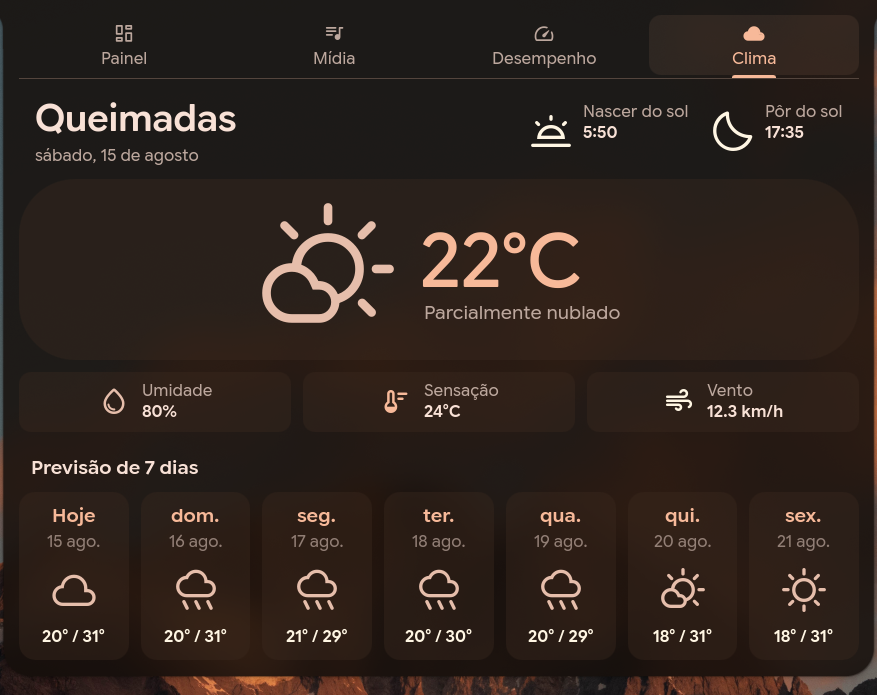
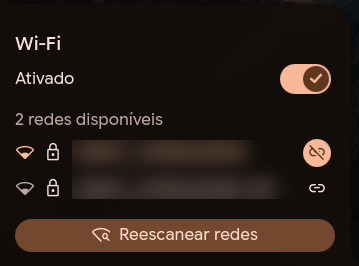
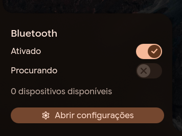
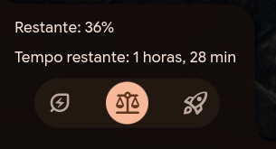
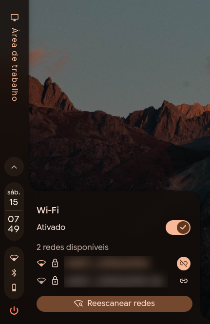
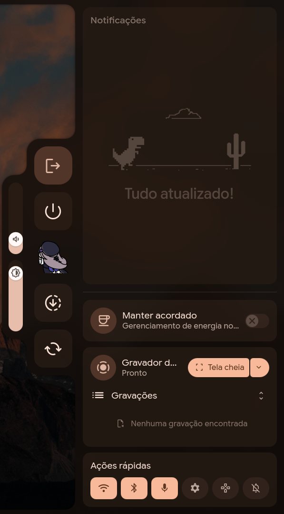

# caelestia-ptbr

🌐 **Português (Brasil)** · [English](README.en.md)

Tradução para **português do Brasil** do [Caelestia shell](https://github.com/caelestia-dots/shell).

O Caelestia marca seus textos com `qsTr()`, mas o quickshell não carrega catálogos de tradução —
então nada nunca aparece traduzido, por mais que o sistema esteja em pt-BR. Este projeto contorna
isso editando os literais no próprio QML, a partir de uma cópia do shell que fica no seu `~/.config`.
O pacote original nunca é tocado.

Um comando instala, e a tradução se reaplica sozinha depois de cada `pacman -Syu`.

---

## Como fica

| | |
|:--:|:--:|
|  |  |
| **Painel** — clima, calendário e uptime | **Mídia** — estado dos reprodutores |
|  |  |
| **Desempenho** — CPU, disco, rede e memória | **Clima** — previsão de 7 dias e condições |
|  |  |
| **Wi-Fi** | **Bluetooth** |
|  |  |
| **Bateria** — perfil de energia e tempo restante | **Barra** — data no locale correto |



**Sidebar** — notificações, gravador de tela e ações rápidas.

---

## Por que não dá para usar um arquivo `.qm`

Essa é a parte que costuma custar algumas horas para descobrir, então vai documentada.

O jeito normal de traduzir um app Qt é gerar um catálogo `.qm` e deixar o Qt carregá-lo. O Qt
até tem carregamento automático: basta pôr `i18n/qml_pt_BR.qm` ao lado do QML principal. Só que
**esse recurso é do `QQmlApplicationEngine`**, e o quickshell usa `QQmlEngine` puro. Sem um
`QTranslator` instalado no `QCoreApplication`, `qsTr("Wireless")` devolve `"Wireless"` — sempre.

Dá para conferir na sua máquina:

```bash
nm -D /usr/bin/qs | grep -ci QQmlApplicationEngine   # 0
nm -D /usr/bin/qs | grep -ci QTranslator             # 0
```

Nenhum catálogo será carregado, não importa onde ele esteja. Por isso a única saída é editar o
texto no código-fonte — que é exatamente o que este script faz, de forma reproduzível.

Havia ainda um segundo problema, sem relação com catálogos: `services/Time.qml` usava
`Qt.formatDateTime(data, formato)`, que resolve nomes de dia e mês pelo locale **C**. O resultado
era uma barra escrita `"Sat 15"` ao lado de um calendário escrito `"Agosto 2026"`. Corrigido para
`toLocaleString(Qt.locale(), formato)`, o mesmo padrão que o resto do shell já usava.

---

## O que é traduzido

**231 strings** no mapa e **32 regras** de código, dando **268 substituições em 61 arquivos**:

- barra, popouts de Wi-Fi, Bluetooth, bateria e Caps/Num lock
- dashboard inteiro: Painel, Mídia, Desempenho e Clima
- launcher, tela de bloqueio, notificações, sidebar, OSD, menu de sessão e utilitários
- datas e horas no locale certo (`"sáb. 15"`, `"sábado, 15 de agosto"`, `"15 ago."`)
- uptime, durações de bateria e condições do tempo (mapa de códigos WMO)
- avisos de bateria fraca — que nem estão no QML: são valores padrão compilados dentro do
  `libcaelestia-config.so`, traduzidos na hora de exibir
- enums que vêm em inglês do C++ do quickshell (`PowerProfile`, `PerformanceDegradationReason`)
- plurais reescritos: o inglês concatena `"s"`, o português flexiona substantivo *e* adjetivo,
  então esses viram frases completas em vez de sufixo

**Deliberadamente fora:**

| O quê | Por quê |
|---|---|
| Painel de configurações (`modules/nexus/`) | 524 das 819 ocorrências, quase tudo jargão onde o inglês é mais claro |
| `description:` dos atalhos globais | são identificadores de keybind para o portal do Hyprland, não texto de tela |
| `"The account is locked"` em `lock/Pam.qml` | não é exibido: é um `startsWith()` comparando com a saída do PAM. Traduzir quebra a checagem |
| `Enhanced Open`, `Enterprise` | nomes de padrões de segurança Wi-Fi (WPA3-OWE), como no NetworkManager |

---

## Requisitos

- [caelestia-shell](https://github.com/caelestia-dots/shell) instalado em `/etc/xdg/quickshell/caelestia`
- quickshell (`qs`) no PATH
- Python 3.9+ e Bash

Desenvolvido contra `caelestia-shell 2.3.0` e `quickshell 0.3.0` no Arch/CachyOS. Deve funcionar
em qualquer distro — nada aqui depende do pacman.

## Instalação

```bash
git clone https://github.com/xKIROxKUNx/caelestia-ptbr.git
cd caelestia-ptbr
./instalar.sh
```

O instalador confere as dependências, copia os arquivos, ativa a reaplicação automática, traduz
e reinicia o shell. Rodar de novo é seguro.

Quer ver o que mudaria antes de instalar?

```bash
./caelestia-ptbr --dry-run
```

## Desinstalação

```bash
./desinstalar.sh
```

Remove a cópia traduzida e o shell volta a carregar `/etc/xdg`. Como o pacote original nunca é
modificado, `pacman -Qkk caelestia-shell` continua limpo o tempo todo.

---

## Atualizar

Sempre que houver correções ou strings novas, dentro do seu clone:

```bash
./atualizar.sh
```

Ele busca a versão nova, mostra o que mudou, reinstala e reinicia o shell. **Não precisa clonar
de novo** — o script atualiza o próprio clone em que está.

Se não houver novidade, ele diz e sai sem mexer em nada. O que mudou em cada versão está no
[CHANGELOG](CHANGELOG.md).

## Ajustar uma palavra

Não gostou de alguma tradução? Crie `~/.config/caelestia-ptbr/local.tsv` com só o que quer mudar:

```
Rescan networks	Buscar redes de novo
Nothing playing	Nenhuma mídia
```

Mesmo formato do mapa base — `inglês<TAB>português`, um por linha — e o que estiver aqui **vence**.

Esse arquivo é seu: nem o instalador nem o `atualizar.sh` encostam nele, então seus ajustes
sobrevivem a todas as atualizações do projeto. Depois de editar:

```bash
caelestia-ptbr && caelestia shell -k && caelestia shell -d
```

O mapa completo, para consulta, é o [`pt_BR.tsv`](pt_BR.tsv). Strings ausentes dos dois arquivos
simplesmente ficam em inglês — nunca quebram nada.

---

## Como funciona

**Cópia em vez de patch.** O quickshell procura configurações em cada diretório XDG, e
`~/.config` tem prioridade sobre `/etc/xdg`. O script copia o shell para
`~/.config/quickshell/caelestia` e traduz ali, então `qs -c caelestia` passa a carregar a versão
em português sem que nenhum arquivo do pacote seja tocado.

**Sempre parte do original.** Cada execução re-sincroniza de `/etc/xdg` antes de traduzir. Não
há divergência acumulada, e o resultado é idempotente: rodar duas vezes dá árvores byte a byte
idênticas.

**Troca atômica.** A árvore nova é montada em `caelestia.new` e só então renomeada por cima da
antiga. Apagar a cópia em uso quebraria os componentes que o shell carrega sob demanda.

**Substituição ancorada em `qsTr(`.** Só o literal imediatamente dentro de `qsTr(` é trocado.
Isso não é preciosismo: o QML usa palavras em inglês como identificadores internos — os ícones
Material se chamam `"search"` e `"home"`, e há estados chamados `"visible"` e `"background"`.
Um replace solto trocaria esses e quebraria a interface.

**Regras para o que não é `qsTr()`.** A lista `RULES`, no topo de
[`caelestia-ptbr`](caelestia-ptbr), cobre o que nenhum catálogo pegaria: rótulos nunca marcados
como traduzíveis, formatos de data, plurais e enums vindos do C++. Cada regra é um par
`(arquivo, trecho original, substituto)` e falha ruidosamente se o upstream mudar o código.

**Duas atualizações diferentes, dois mecanismos.** Vale entender a distinção:

| O que muda | Como a tradução acompanha |
|---|---|
| O **Caelestia** é atualizado pelo `pacman -Syu` | Automático. A unidade `caelestia-ptbr.path` vigia `/etc/xdg/quickshell/caelestia/shell.qml` e reaplica a tradução sozinha |
| A **tradução** ganha correções ou strings novas | Você roda `./atualizar.sh` quando quiser |

O primeiro caso é o que quebraria a interface se ficasse sem tratamento, então é o automático.
O segundo é uma melhoria: até você atualizar, strings novas do upstream aparecem em inglês —
degrada bem, nunca quebra.

---

## Traduzir para outro idioma

O script não tem nada de específico do português além dos dados. Para levar o Caelestia ao seu
idioma:

**1. Extraia as strings do shell** (fora do painel de configurações):

```bash
grep -rhoP 'qsTr\(\s*"(?:[^"\\]|\\.)*"' /etc/xdg/quickshell/caelestia \
    --include='*.qml' --exclude-dir=nexus \
  | sed -E 's/^qsTr\(\s*"//; s/"$//' | sort -u > strings.txt
```

São 255 linhas. Tire `--exclude-dir=nexus` se quiser as 617 do shell inteiro.

**2. Monte seu mapa.** Copie `pt_BR.tsv` para `xx_XX.tsv` e traduza a segunda coluna. Regras:

- separador é **TAB**, não espaços
- linhas com `#` são comentários; strings que devem ficar em inglês são simplesmente omitidas
- preserve os placeholders `%1`, `%2` e os escapes `\"` e `\n` exatamente como estão

**3. Ajuste as `RULES`** no topo de `caelestia-ptbr`. Muitas valem para qualquer idioma (a
correção de data, os enums), mas a ordem da data, os plurais e as condições do tempo precisam
do seu idioma.

**4. Teste sem risco:**

```bash
./caelestia-ptbr --map xx_XX.tsv --dry-run
```

Ele relata quantas substituições faria e lista as strings do mapa que não casaram — útil para
achar erros de digitação. Quando estiver bom, tire o `--dry-run`.

Traduções para outros idiomas são bem-vindas via pull request.

---

## Licença

GPL-3.0, a mesma do Caelestia shell. Este repositório não redistribui código do upstream: contém
apenas o script, o mapa de tradução e capturas de tela.

## Créditos

[caelestia-dots/shell](https://github.com/caelestia-dots/shell) pelo shell, e
[quickshell](https://quickshell.org) pelo runtime.
